# Product Requirements Document (PRD): Sistem Penggajian (Payroll) & HR

## 1. Overview & Latar Belakang Masalah
Banyak perusahaan menghadapi inefisiensi dalam mengelola data karyawan, absensi, dan perhitungan gaji secara manual atau dengan sistem terpisah. Proses ini rentan terhadap *human error*, memakan waktu berhari-hari, dan menyulitkan pelacakan historis serta kepatuhan (compliance) terhadap regulasi pajak (PPh 21) dan BPJS yang terus berubah. Oleh karena itu, dibutuhkan sebuah sistem HR & Payroll *end-to-end* otomatis dan terintegrasi untuk mengelola siklus karyawan, absensi, cuti, hingga distribusi slip gaji. Sistem ini dirancang pada standar *enterprise-grade* dengan fondasi arsitektur data yang *scalable* (mendukung perluasan multi-cabang di masa depan).

## 2. Tujuan Produk & Success Metrics
**Tujuan:**
- Menciptakan *single source of truth* untuk seluruh data HR dan penggajian perusahaan.
- Mengotomatisasi dan menjamin akurasi perhitungan gaji bersih (Gross-to-Net), PPh 21 (metode TER terbaru), serta BPJS.
- Memberikan pengalaman *self-service* yang baik bagi karyawan untuk transparansi slip gaji, cuti, dan data pribadi.

**Success Metrics / KPI (Bulan ke-6 post-launch):**
- Waktu proses *payroll run* berkurang dari hitungan hari (misal 3 hari) menjadi < 4 jam.
- *Error rate* pada perhitungan pajak dan BPJS = 0%.
- *Adoption rate* *Employee Self-Service (ESS) Portal* > 80%.
- Pengurangan beban administratif HR terkait rekap data sebesar 70%.

## 3. Target Pengguna & User Roles
1. **Super Admin:** Mengelola konfigurasi sistem fundamental, struktur organisasi, dan hak akses pengguna.
2. **HR Admin:** Mengelola master data karyawan, absensi, mutasi, dan memonitor approval cuti/lembur.
3. **Finance/Payroll Admin:** Mengeksekusi *payroll run*, memvalidasi perhitungan, dan melakukan pencairan dana (payment release).
4. **Manager / Approver:** Meninjau dan menyetujui pengajuan cuti dan lembur dari tim di bawahnya.
5. **Employee (Karyawan):** Mengajukan cuti, melihat slip gaji, memperbarui data diri secara mandiri (ESS).

## 4. User Stories / Use Cases Utama
**Karyawan:**
- Sebagai karyawan, saya ingin melihat rincian gaji saya (slip gaji) setiap bulan agar memahami komponen pendapatan dan potongan saya.
- Sebagai karyawan, saya ingin mengajukan cuti dan melihat sisa saldo cuti secara real-time.
- Sebagai karyawan, saya ingin memperbarui kontak darurat saya agar HR memiliki data terkini tanpa perlu formulir kertas.

**Manager / Approver:**
- Sebagai manajer, saya ingin melihat daftar pengajuan cuti bawahan saya agar saya bisa melakukan approve/reject sesuai ketersediaan tim.
- Sebagai manajer, saya ingin mendapat notifikasi email ketika ada bawahan yang mengajukan lembur.

**HR Admin:**
- Sebagai HR, saya ingin mengimpor data absensi bulanan dari mesin *fingerprint* agar tidak perlu memasukkan data satu-per-satu.
- Sebagai HR, saya ingin memproses mutasi jabatan karyawan dan otomatis memicu penyesuaian perhitungan *payroll* bulan depan.

**Finance / Payroll Admin:**
- Sebagai Finance, saya ingin melakukan simulasi (*dry-run*) *payroll* sebelum finalisasi untuk memastikan perhitungan pajak sesuai.
- Sebagai Finance, saya ingin mengekspor laporan PPh 21 (e-Bupot) untuk diunggah langsung ke sistem DJP.

## 5. Fitur Utama Per Modul

### Modul 1: Manajemen Data Karyawan (Employee Management)
- **CRUD Karyawan:** Mengelola data demografis, kontak darurat, dan informasi perbankan.
- **Status Kepegawaian:** Mengatur status (tetap, kontrak, probation, part-time, resign, terminated).
- **Riwayat Mutasi & Gaji:** Melacak histori promosi, demosi, mutasi departemen, dan riwayat penyesuaian gaji (*audit-ready*).
- **Manajemen Dokumen:** Upload dan penyimpanan KTP, NPWP, ijazah, dan kontrak.
- **Struktur Organisasi:** Hierarki departemen, divisi, jabatan, serta penentuan atasan langsung (untuk *approval line*).

### Modul 2: Struktur Gaji & Komponen (Salary Structure)
- **Definisi Komponen:** Gaji pokok, tunjangan tetap, tunjangan variabel/tidak tetap.
- **Template Struktur:** Template default per jabatan/grade untuk standarisasi.
- **Komponen Potongan:** BPJS, PPh 21, pinjaman/kasbon, absen/keterlambatan.
- **Dynamic Component Engine:** HR dapat menambahkan komponen penghasilan atau potongan baru dengan tipe *fixed amount* atau *formula/percentage* tanpa *hardcode*.

### Modul 3: Absensi & Waktu Kerja (Attendance & Time Management)
- **Input & Import:** Input manual oleh HR atau *bulk upload* via Excel/CSV. API-ready untuk integrasi *fingerprint/FaceID*.
- **Shift & Jam Kerja:** Pengaturan jam kerja reguler dan *shift*.
- **Penalty & Keterlambatan:** Perhitungan durasi telat dan pulang cepat, terhubung ke komponen potongan gaji.
- **Lembur (Overtime):** Pengajuan lembur oleh karyawan, validasi *clock in/out*, perhitungan indeks lembur otomatis.

### Modul 4: Cuti & Izin (Leave Management)
- **Tipe Cuti:** Konfigurasi cuti tahunan, sakit (dengan/tanpa MC), melahirkan, cuti besar, unpaid leave.
- **Accrual & Carry-over:** Perhitungan saldo otomatis bertambah tiap bulan/tahun dan kebijakan hangus/pindah ke tahun berikutnya.
- **Pengajuan & Approval:** Karyawan mengajukan via sistem, diteruskan ke atasan dan HR dengan notifikasi email/in-app.
- **Team Leave Calendar:** Kalender visibilitas cuti bagi manajer untuk mencegah bentrok cuti dalam satu tim.

### Modul 5: Perhitungan Payroll (Payroll Processing)
- **Batch Processing:** Eksekusi *payroll* untuk seluruh atau sebagian karyawan dalam satu periode.
- **Perhitungan Otomatis:** Agregasi pendapatan (gaji + tunjangan + lembur) dikurangi potongan (BPJS + Pajak + Pinjaman).
- **Prorata Calculation:** Perhitungan hari kerja proporsional untuk karyawan masuk/keluar di pertengahan cut-off.
- **Dry-run & Validasi:** Mode simulasi untuk memeriksa anomali gaji sebelum di-submit.
- **Approval Lapis:** *Submit* oleh HR -> *Review/Approve* oleh Finance -> *Payment Release*.

### Modul 6: Pajak PPh 21 (Tax Calculation)
- **Kalkulator TER:** Perhitungan menggunakan Tarif Efektif Rata-rata (TER A/B/C) sesuai regulasi PP 58/2023 untuk masa Januari-November, dan hitung ulang tahunan di Desember.
- **Manajemen PTKP:** Sinkronisasi status perkawinan/tanggungan (TK/0, K/1, dll) dengan sistem pajak.
- **Form 1721-A1:** *Generate* otomatis bukti potong tahunan untuk pelaporan SPT karyawan.
- **Export e-Bupot:** Format file CSV standar DJP untuk pelaporan masa.

### Modul 7: BPJS & Asuransi
- **Kalkulasi BPJS:** Kesehatan (1% karyawan, 4% prshn), Ketenagakerjaan (JHT, JKK, JKM, JP).
- **Ceiling & Floor Limit:** Pengaturan dinamis batas maksimal/minimal upah untuk dasar perhitungan BPJS yang dapat disesuaikan jika regulasi berubah.
- **Laporan Instansi:** Format rekap iuran untuk pelaporan/pembayaran BPJS/Edabu.

### Modul 8: Slip Gaji & Pelaporan (Payslip & Reporting)
- **Generate Payslip:** Otomatisasi PDF dengan proteksi *password*.
- **Distribusi:** Kirim via email otomatis saat *payment release* atau akses mandiri (*self-service*) di ESS.
- **Dashboard Analitik:** Visualisasi tren biaya *payroll*, headcount, distribusi biaya antar departemen.
- **Export Reports:** *Payroll summary*, buku besar (gl), laporan pajak & BPJS (*Excel/PDF/CSV*).

### Modul 9: Administrasi & Keamanan
- **RBAC:** Kontrol akses berjenjang.
- **Audit Log:** Perekaman aktivitas (User X mengubah Gaji Y pada Waktu Z).
- **ESS Portal:** Portal karyawan yang *mobile-responsive* (web-based).

## 6. Business Rules & Formula Perhitungan

- **Urutan Perhitungan (Gross to Net):**
  1. Base Salary + Fixed Allowance = Regular Income
  2. Regular Income + Variable Allowance + Overtime = Gross Income
  3. Hitung BPJS Karyawan dan Perusahaan dari dasar gaji yang diatur.
  4. Hitung PPh 21 (TER / Tahunan) dari Gross Income + JKK/JKM (Premi Perusahaan) - JHT/JP (Iuran Karyawan) - Biaya Jabatan.
  5. Gross Income - BPJS Karyawan - PPh 21 - Potongan Lain (Kasbon, telat) = Net Take Home Pay.
- **Prorata Gaji:**
  - Formula: `(Hari Kerja Aktual / Hari Kerja Efektif Bulanan) * Gaji Sebulan`.
  - Digunakan bagi karyawan yang baru bergabung atau *resign* di dalam rentang cut-off.
- **Lembur (Overtime):**
  - Mengikuti Kepmenaker 102/MEN/2004.
  - Dasar upah per jam = `1/173 * Gaji Sebulan (Pokok + Tunj. Tetap)`.
  - Hari Kerja Biasa: Jam 1 = 1.5x upah sejam. Jam ke-2 dst = 2x.
  - Hari Libur/Akhir Pekan: Menggunakan *approval flow* yang sama persis dengan hari biasa (Manager), namun sistem menggunakan *flag* khusus (`is_weekend` / `is_holiday`) untuk menerapkan *multiplier* (2x - 4x) yang lebih tinggi secara otomatis tanpa mengubah alur persetujuan.
- **Payroll Cycle:**
  - Absensi Cut-off: Tgl 21 bln sblmnya - Tgl 20 bln berjalan.
  - Payroll Run & Approval: Tgl 21 - Tgl 24.
  - Payment Release & Payslip: Tgl 25.

## 7. Approval Workflow

- **Cuti & Lembur (State Machine):**
  `DRAFT` -> [Karyawan Submit] -> `PENDING_MANAGER` -> [Manager Approve] -> `PENDING_HR` -> [HR Approve] -> `APPROVED`
  *(Jika ditolak di tahap manapun status menjadi `REJECTED`)*.
- **Payroll Run:**
  `DRAFT` -> [HR Execute & Submit] -> `PENDING_FINANCE` -> [Finance Review & Approve] -> `APPROVED` -> [Finance Execute Payment] -> `PAID/COMPLETED`.
- **Eskalasi:** Jika Manager tidak merespon dalam 3 hari kalender, status otomatis naik ke HR atau Atasan berikutnya (*auto-escalate*).

## 8. Role-Based Access Control (RBAC) Permission Matrix

| Modul/Fitur             | Super Admin | HR Admin | Finance Admin | Manager  | Employee |
|-------------------------|-------------|----------|---------------|----------|----------|
| User & Role Config      | CRUD        | Read     | No Access     | No Access| No Access|
| Employee Data (All)     | CRUD        | CRUD     | Read          | Read (Tim)| No Access|
| Employee Data (Self)    | CRUD        | CRUD     | CRUD          | CRUD     | R/U (Limit)|
| Salary Structure        | CRUD        | CRUD     | Read          | No Access| No Access|
| Attendance & Leave (All)| CRUD        | CRUD     | Read          | Read (Tim)| No Access|
| Approve Leave/Overtime  | Yes         | Yes      | No            | Yes (Tim)| No       |
| Payroll Run             | CRUD        | Create/R | Approve/Exec  | No Access| No Access|
| Tax & BPJS Config       | CRUD        | CRUD     | CRUD          | No Access| No Access|
| View Payslip (All)      | Read        | Read     | Read          | No Access| No Access|
| View Payslip (Self)     | Read        | Read     | Read          | Read     | Read     |
| Analytics & Reports     | Read        | Read     | Read          | No Access| No Access|
| Audit Log               | Read        | No Access| No Access     | No Access| No Access|

## 9. Skema Data & Arsitektur

### Bagian 1: Penjelasan Naratif Tabel

1. **`users`**: Tabel autentikasi (email, password_hash, role_id). Relasinya ke `employees` adalah *zero-or-one*, dengan asumsi ada user khusus (seperti Super Admin) yang bukan merupakan karyawan, dan sebaliknya ada karyawan baru yang belum dibuatkan/diaktivasi akun *user*-nya.
2. **`employees`**: Data demografis dan identitas karyawan (user_id, nama, NIK, KTP, tgl_lahir, tgl_bergabung, status_karyawan, department_id, position_id). Kolom `position_id` dan `department_id` di sini adalah denormalisasi (status/posisi *current state*) untuk kemudahan dan kecepatan *query*.
3. **`departments`**: Master data departemen (id, nama, parent_department_id). Kolom `parent_department_id` digunakan untuk relasi hierarki *self-referencing* (divisi di dalam departemen utama).
4. **`positions`**: Master data jabatan (id, nama, level/grade).
5. **`employee_position_history`**: Riwayat pergerakan/mutasi karyawan (employee_id, position_id, department_id, start_date, end_date, alasan).
   - *Aturan Konsistensi:* Sebagai *log* historis lengkap, setiap ada *insert* baru di tabel ini dengan `end_date` bernilai `NULL` (menandakan jabatan aktif), sistem (via *application logic* atau *trigger*) akan otomatis melakukan *update* pada kolom `position_id` dan `department_id` di tabel `employees`.
6. **`employee_bank_accounts`**: Penyimpanan data rekening bank karyawan (employee_id, bank_name, account_number, account_holder_name, is_active).
   - *Alasan Pemisahan:* Data perbankan sangat sensitif sehingga dipisah dari tabel `employees` utama untuk menerapkan kontrol akses (RBAC) yang lebih ketat, enkripsi kolom secara spesifik, serta memungkinkan penyimpanan riwayat jika karyawan mengganti rekening gaji.
7. **`salary_structures`**: Master template gaji per jabatan/grade (id, nama, position_id). Tabel ini merepresentasikan *template* standar. Ketika ada karyawan baru masuk, *template* ini akan disalin/di-*apply* ke tabel `employee_salary_components`.
8. **`salary_structure_components`**: Tabel *mapping* (id, salary_structure_id, component_id, default_amount). Menghubungkan satu struktur gaji dengan beberapa *template* komponen defaultnya.
9. **`salary_components`**: Master komponen gaji dinamis (id, nama, tipe [allowance/deduction], sifat [fixed/variable], is_taxable).
10. **`employee_salary_components`**: Nilai aktual/spesifik komponen gaji untuk setiap karyawan secara individual (employee_id, component_id, amount). Berbeda dengan *structure*, tabel ini menyimpan nominal *real* yang diterima karyawan bersangkutan.
11. **`employee_loans`**: Manajemen potongan cicilan/kasbon/pinjaman (id, employee_id, total_amount, remaining_balance, installment_amount_per_month, start_date, estimated_end_date, status [active/completed]).
    - Setiap proses *payroll run*, sistem akan otomatis men-*generate* satu baris rincian potongan di `payslip_components` untuk setiap cicilan yang statusnya aktif, lalu mengurangi nilai `remaining_balance` di tabel ini.
12. **`attendance_records`**: Rekaman harian kehadiran (id, employee_id, tanggal, clock_in, clock_out, status_kehadiran, late_minutes).
13. **`overtime_requests`**: Pengajuan lembur (id, employee_id, attendance_record_id, tanggal, start_time, end_time, multiplier, status_approval).
    - Memiliki *foreign key* `attendance_record_id` yang mereferensi langsung ke `attendance_records.id`. Pengajuan lembur harus divalidasi dan dicocokkan dengan data *clock-in/clock-out* aktual di sistem absensi sebelum bisa disetujui.
14. **`leave_types`**: Jenis cuti (id, nama, max_days, is_carry_forward).
15. **`leave_balances`**: Saldo cuti tahun berjalan (employee_id, leave_type_id, year, balance, used).
16. **`leave_requests`**: Transaksi pengajuan cuti (employee_id, leave_type_id, start_date, end_date, alasan, status_approval).
17. **`payroll_runs`**: *Header* proses payroll per periode (id, nama_periode, start_date, end_date, status_run, total_gross, total_net).
18. **`payslips`**: Rekaman payslip per karyawan (id, payroll_run_id, employee_id, basic_salary, gross_pay, net_pay).
19. **`payslip_components`**: Rincian komponen pendapatan dan potongan pada *payslip* (payslip_id, component_id, employee_loan_id, amount).
20. **`tax_records`**: Rekaman PPh 21 (payslip_id, ptkp_status, pkp_amount, tax_amount).
21. **`bpjs_records`**: Rekaman potongan BPJS (payslip_id, bpjs_kes_karyawan, bpjs_tk_jht, dll).
22. **`approvals` & `approval_logs`**: Tabel *polymorphic* untuk mencatat *state approval* (approvable_type, approvable_id, level, approver_id, status).
23. **`audit_logs`**: Pencatatan aktivitas sistem.
24. **`notifications`**: Sistem notifikasi in-app.

### Bagian 2: Visualisasi ERD (Mermaid)

```mermaid
erDiagram
    users ||--o| employees : "has (zero or one)"
    departments ||--o{ departments : "parent"
    departments ||--o{ employees : "current department"
    positions ||--o{ employees : "current position"
    
    employees ||--o{ employee_position_history : "has history"
    positions ||--o{ employee_position_history : "recorded in"
    departments ||--o{ employee_position_history : "recorded in"
    
    employees ||--o{ employee_bank_accounts : "owns"
    
    positions ||--o{ salary_structures : "uses template"
    salary_structures ||--o{ salary_structure_components : "contains"
    salary_components ||--o{ salary_structure_components : "mapped to"
    
    salary_components ||--o{ employee_salary_components : "defines"
    employees ||--o{ employee_salary_components : "has specific amount"
    
    employees ||--o{ employee_loans : "has active installments"
    employee_loans ||--o{ payslip_components : "deducted in"
    
    employees ||--o{ attendance_records : "logs"
    attendance_records ||--o{ overtime_requests : "validates"
    employees ||--o{ overtime_requests : "requests"
    
    leave_types ||--o{ leave_balances : "defines limit"
    employees ||--o{ leave_balances : "has balance"
    employees ||--o{ leave_requests : "submits"
    leave_types ||--o{ leave_requests : "is type of"
    
    payroll_runs ||--o{ payslips : "generates"
    employees ||--o{ payslips : "receives"
    payslips ||--o{ payslip_components : "contains"
    salary_components ||--o{ payslip_components : "originates from"
    
    payslips ||--|| tax_records : "must have exactly one"
    payslips ||--|| bpjs_records : "must have exactly one"
    
    users ||--o{ audit_logs : "performs"
    users ||--o{ notifications : "receives"
    users ||--o{ approvals : "approves"
```

## 10. Non-Functional Requirements (NFR)
- **Keamanan & Privasi:**
  - Data *at-rest* dan *in-transit* (HTTPS/TLS 1.2+).
  - Data NIK, Gaji, Rekening Bank dienkripsi di level *database*.
  - *Data masking* di UI untuk role yang tidak berhak (misal: NIK tampil sebagai `***1234`).
- **Audit & Kepatuhan:** Seluruh manipulasi data (Create, Update, Delete) harus tersimpan di `audit_logs` dan tidak dapat diubah (Immutable). Patuh regulasi UU HPP dan UU Ketenagakerjaan RI.
- **Performa:** Sistem harus mampu memproses *payroll run* untuk 1,000 karyawan secara *batch* dalam waktu maksimal 10 menit tanpa RTO (Request Time Out). Implementasi *queue/background job* wajib untuk *payroll engine*.
- **Ketersediaan (Availability):** Target Uptime 99.9% dengan fitur *automated daily backup*.

## 11. Asumsi & Batasan (Assumptions & Constraints)
- **Asumsi:** Karyawan memiliki akses internet untuk mengakses Employee Self-Service. Kebijakan pajak dan BPJS mengikuti regulasi Indonesia terkini (2024 ke atas).
- **Batasan:** Waktu respons integrasi API pihak ketiga (misal: Mesin Absensi) bergantung pada vendor mesin bersangkutan.

## 12. Out of Scope (Versi / Fase 1)
- Multi-company / Multi-tenant architecture (Sistem saat ini didesain scalable secara DB, namun logika aplikasi fokus ke *single-company* multi-cabang).
- Integrasi Payment Gateway API/Host-to-Host (H2H) dengan Bank secara *real-time* (Pencairan dana masih menggunakan format ekspor CSV Bank/Manual transfer).
- Aplikasi *Native Mobile* (Android/iOS) — ESS akan menggunakan *Responsive Web App*.
- Modul *Performance Management* (KPI/OKR) & Rekrutmen (ATS).
- Integrasi Sistem Akuntansi / ERP via API (misal: Xero, Jurnal, Accurate). Untuk Fase 1, pelaporan akan mengandalkan ekspor laporan CSV/Excel manual yang akan di-input oleh tim Finance.
- Skema potongan berjenjang dengan perhitungan bunga dinamis (koperasi/kasbon kompleks). Potongan pinjaman/cicilan difokuskan pada tipe *flat/fixed installment* sederhana tanpa bunga.

## 13. Roadmap & Fase Pengembangan
- **Phase 1 (Core HR & Attendance):** Employee data, struktur organisasi, manajemen shift & kehadiran, ESS dasar.
- **Phase 2 (Payroll & Tax Engine):** Struktur gaji, engine perhitungan gaji, PPh 21, BPJS, payslip generation.
- **Phase 3 (Leave, Overtime & Approval Workflow):** Pengajuan cuti, overtime, kalender cuti, dan engine multi-level approval.
- **Phase 4 (Reporting & Integrations):** Export e-Bupot, export laporan BPJS, dashboard analitik HR, integrasi API mesin absen.
- **Phase 5 (Future / Advanced Integrations):** Integrasi *Chart of Accounts* dengan sistem Akuntansi/ERP pihak ketiga via API (Xero, Jurnal, Accurate, dll) dan pemetaan jurnal otomatis.
